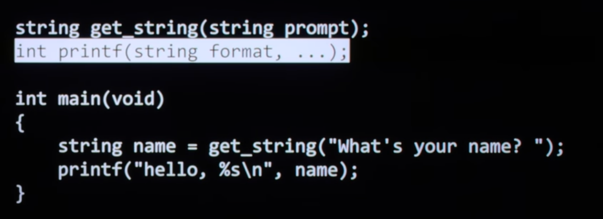
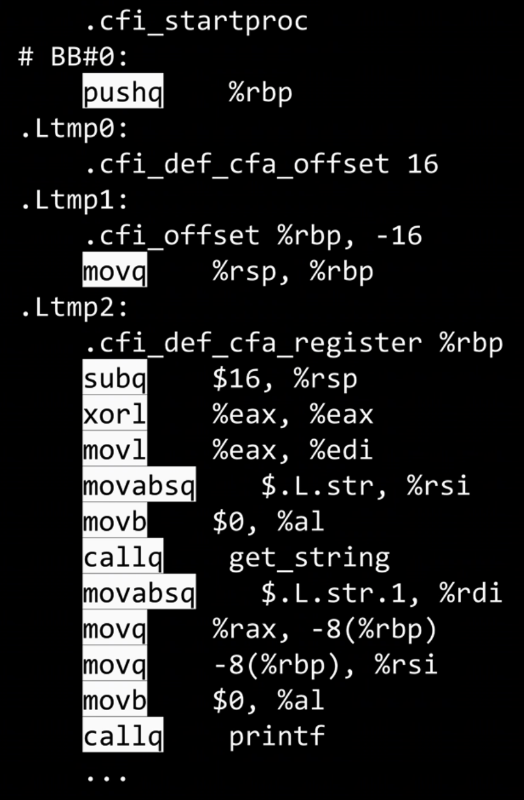
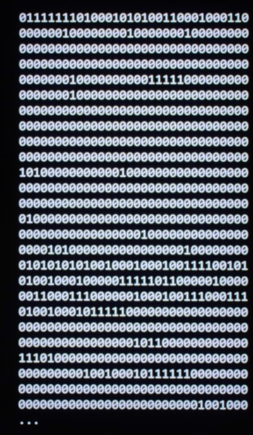
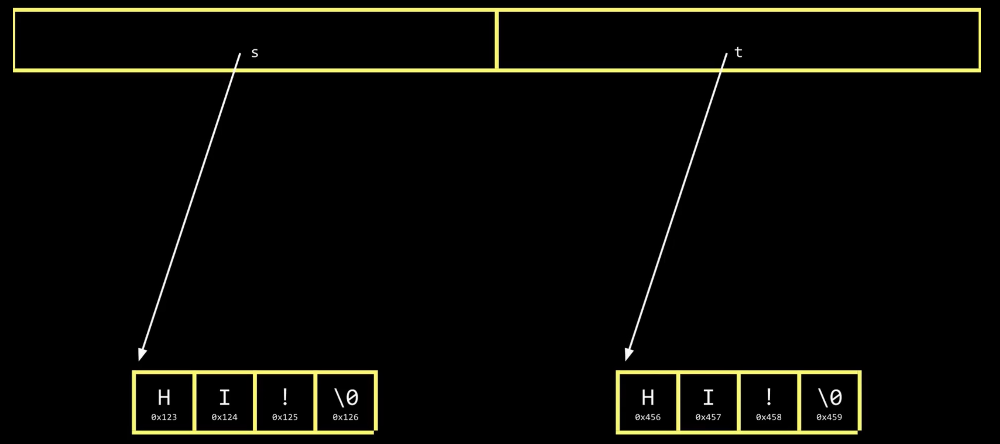
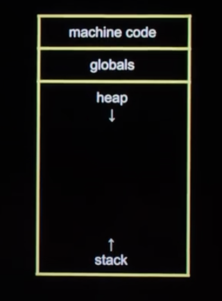

---

- 代码是怎么被编译成机器能执行的东西
- 数组和字符串在内存里到底长什么样
- 指针为什么既强大又危险
- 为什么很多看起来“只是语法”的东西，本质上都和地址有关

---

## 1. C 程序是怎么变成可执行文件的

C 编译器并不是“神奇地一下子把代码跑起来”，而是大致会经历四个阶段：

1. 预处理（Preprocessing）
2. 编译（Compiling）
3. 汇编（Assembling）
4. 链接（Linking）

---

### 1.1 预处理

预处理最典型的动作就是处理 `#include` 和 `#define`。

比如当你写：

```c
#include <cs50.h>
```

预处理阶段做的事情，本质上就是把 `cs50.h` 里的文本内容直接展开进来。

> 头文件通常只有“声明”，不一定有真正的函数实现。

```c
// cs50.h 内部节选，全是原型
int get_int(const char* prompt);
char* get_string(const char* prompt);
long get_long(const char* prompt);
float get_float(const char* prompt);
```

<div align="center">
  
</div>

---

### 1.2 编译

这一步会把 C 代码翻译成汇编代码。汇编已经非常接近机器，但还不是最终的 0 和 1。

<div align="center">
  
</div>

---

### 1.3 汇编

汇编器再把汇编代码转成真正的机器码，也就是二进制指令。

<div align="center">
  
</div>

---

### 1.4 链接

最后一步是把你自己的代码和标准库、第三方库真正连接起来，拼成一个完整的可执行文件。

<div align="center">
  
</div>

这一层理解很重要，因为它提醒我们：

- `#include` 不是“导入包”那种高级语义，而是更接近文本展开
- 函数声明和函数实现是两回事
- 库之所以能用，是因为最后链接阶段把它们接进来了

---

## 2. `main` 的参数：程序其实也会“接收输入”

`main` 不一定非得是 `int main(void)`，也可以写成：

```c
int main(int argc, string argv[]) {
    printf("%s\n", argv[0]);
    printf("Hello, %s\n", argv[1]);
}
```

这里：

- `argc` = argument count，参数个数
- `argv` = argument vector，参数字符串数组

例如：

```bash
$ ./a.out MaHang
./a.out
Hello, MaHang
```

其中：

- `argv[0]` 永远是程序自身名字
- `argv[1]` 才是你手动输入的第一个参数

这里第一次出现了一个特别重要的概念：**字符串数组**。

也就是说，程序启动参数本质上已经在暗示你：

- 字符串其实就是字符序列
- 多个字符串可以放在数组里
- C 非常喜欢把“看起来高级的东西”还原成数组和地址

---

## 3. 算法复杂度：先学会从“增长趋势”看程序

这部分是理解算法时最基础的一层抽象。

---

### 3.1 大 O：上界

大 O 关注的是：输入规模变大时，程序的增长趋势是什么。

常见复杂度：

1. $O(1)$：常数时间
2. $O(log n)$：对数时间，比如二分查找
3. $O(n)$：线性时间，比如线性搜索
4. $O(n \log n)$：比如归并排序
5. $O(n^2)$：比如简单的双层比较排序

---

### 3.2 大 Ω：下界

它描述最好情况下至少要做多少工作。

例如二分查找在最幸运时，第一次就找到，所以最好情况可以很低。

---

### 3.3 大 Θ：上下界一致

如果一个算法的上界和下界恰好同阶，就可以用 $\Theta$ 表示。

---

### 3.4 为什么暴力排序是 $O(n^2)$

因为第一次大约比较 `n - 1` 次，第二次 `n - 2` 次，直到最后：

$$
1 + 2 + \cdots + (n - 1) = \frac{n(n - 1)}{2}
$$

最高阶项是 $n^2$，所以复杂度是：

$$
O(n^2)
$$

---

### 3.5 递归的核心不是“自己调自己”，而是“规模缩小 + 正确停止”

递归真正危险的地方不在语法，而在：

- 你有没有让问题规模变小
- 你有没有清晰的终止条件

如果没有终止条件，就会一路压栈，最后导致 `stack overflow`。

---

## 4. 结构体：把相关信息绑在一起，而不是靠人记住对应关系

这一点其实非常像现实中的建模思想。

如果你维护两个数组：

- 一个放名字
- 一个放电话号码

然后假设“下标一一对应”，这就把正确性寄托在人的自觉性上了。

更稳妥的方式是把相关信息封装在一起：

```c
typedef struct {
    string name;
    string number;
} person;

int main(void) {
    person people[3];
    people[0].name = "Kelly";
    people[0].number = "17816616276";
}
```

这就是结构体存在的意义：**把逻辑上应该属于同一个对象的数据，放在一起。**

---

## 5. 数组到底是什么

数组是最基础的数据结构之一。

它的关键特点只有一句话：

**数组中的元素在内存中是连续存放的。**

例如：

```c
int scores[4] = {72, 73, 33, 100};
```

在内存里可以想成这样：

```text
scores[0] scores[1] scores[2] scores[3]
```

它们一个挨一个，没有空洞。

正因为是连续的，所以：

- `scores[0]` 是起点
- `scores[1]` 就是往后移动一个 `int` 的距离
- `scores[i]` 本质上就是“从起点偏移 i 个元素”

这也正是数组和指针关系紧密的根本原因。

---

## 6. 指针是什么

指针本质上就是：**存储地址的变量**。

```c
int n = 50;
int *p = &n;

printf("%p\n", p);
printf("%d\n", *p);
```

这里：

- `&n` 表示变量 `n` 的地址
- `p` 存的是 `n` 的地址
- `*p` 表示“顺着这个地址去取值”

所以：

- `p` 看的是“地址”
- `*p` 看的是“地址对应位置里的内容”

这个区分是理解 C 的关键。

---

## 7. 数组和指针的关系：这是这一讲最值得真正吃透的地方

很多初学者会听到一句话：

> “数组就是指针。”

这句话**不严谨**。

更准确的说法应该是：

> 数组不是指针，但数组在很多表达式里会衰减（decay）成指向首元素的指针。

---

### 7.1 数组名为什么看起来像地址

例如：

```c
int a[4] = {10, 20, 30, 40};
```

在很多场景里，`a` 会被当成 `&a[0]` 来使用。

也就是说：

```c
a == &a[0]
```

在“值”这个层面上通常表现一致。

于是你会看到：

```c
printf("%d\n", a[0]);
printf("%d\n", *a);
printf("%d\n", *(a + 1));
```

分别对应：

- `a[0]`
- `*(a + 0)`
- `*(a + 1)`

所以：

```c
a[i]  <=>  *(a + i)
```

这就是为什么“数组访问”本质上是“指针偏移 + 解引用”。

---

### 7.2 但数组和指针并不完全相同

下面这两个声明不是一回事：

```c
int a[4];
int *p;
```

区别在于：

- `a` 是一整块固定大小的数组空间
- `p` 只是一个指针变量，它自己只负责存地址

也就是说：

- 数组本身“拥有那片连续内存”
- 指针本身“不拥有数据”，只是指向某处

---

### 7.3 为什么 `char *s = "HI!"` 很像数组

```c
char *s = "HI!";
printf("%s\n", s);
printf("%s\n", s + 1);
printf("%s\n", s + 2);
```

输出会是：

```text
HI!
I!
!
```

这是因为字符串本质上就是：

- 一串连续的字符
- 最后以 `'\0'` 结尾

所以 `s + 1` 的意思就是：

- 地址向后移动一个字符
- 从第二个字符开始继续按字符串打印

这段代码很适合帮助理解：

- 指针加法不是“随便 +1”
- 而是“按元素类型跳一个单位”

对于 `char *`，跳 1 字节；
对于 `int *`，跳一个 `int` 的大小。

---

### 7.4 对数组和指针最深的一层理解

我自己的理解是：

- **数组回答的是：数据连续地放在哪里**
- **指针回答的是：我现在从哪个位置开始看**

这两个概念一旦结合，就能解释大量 C 里的现象：

- 为什么 `argv` 是字符串数组
- 为什么字符串比较不能用 `==`
- 为什么函数能通过指针“改掉外部变量”
- 为什么 `scanf` 需要传地址
- 为什么越界访问会出问题

从这个角度看，数组和指针不是两个毫不相关的主题，而是同一个内存模型的两个侧面。

---

## 8. 字符串本质上也是内存问题

在 C 里，不存在高级语言意义上的 `string` 类型。

字符串本质上就是字符数组，或者指向字符序列起点的指针。

```c
char *s = "HI!";
char *t = "HI!";

printf("%s\n", s);

if (strcmp(s, t) == 0) {
    printf("s 和 t 相等\n");
}
```

这里最容易踩坑的是：

```c
s == t
```

这比较的是地址，不是内容。

所以字符串比较应该用：

```c
strcmp(s, t)
```

<div align="center">
  
</div>

---

## 9. 为什么 `swap1` 不生效，而 `swap2` 可以

```c
void swap1(int a, int b) {
    int t = a;
    a = b;
    b = t;
}

void swap2(int *a, int *b) {
    int t = *a;
    *a = *b;
    *b = t;
}
```

核心原因是：**C 默认是值传递。**

也就是说，函数参数拿到的是一份副本。

所以：

- `swap1(x, y)` 只是交换了副本
- `swap2(&x, &y)` 才是把 `x`、`y` 的地址传进去，再通过地址修改原值

这个例子本质上又回到了那个核心问题：

> 你传进去的是“值”，还是“值所在的位置”？

---

## 10. 为什么 `scanf` 也要传地址

```c
int n;
scanf("%d", &n);
```

因为 `scanf` 的任务不是“读取一个值”，而是：

> 把读取到的值写进你的变量里

那它就必须知道这个变量在内存中的位置，所以要传 `&n`。

同理，读字符串时：

```c
char s[1000];
scanf("%s", s);
```

这里看起来没有写 `&`，是因为数组名 `s` 在这里会衰减成首元素地址，本质上已经是在传地址了。

这正好再次说明了：

**数组和指针关系密切，不是巧合，而是语言设计本身如此。**

---

## 11. 动态内存：`malloc` 和 `free`

---

### 11.1 `malloc` 在做什么

`malloc` 的作用是向堆（heap）申请一块运行时才决定大小的内存。

```c
char *t = malloc(strlen(s) + 1);
```

这里申请的是一块足够容纳整个字符串以及结尾 `'\0'` 的空间。

---

### 11.2 复制字符串为什么要自己申请空间

```c
char *s = "hello!";
char *t = malloc(strlen(s) + 1);

for (int i = 0, n = strlen(s); i <= n; i++) {
    t[i] = s[i];
}

t[0] = toupper(t[0]);
printf("%s\n", t);
printf("%s\n", s);
free(t);
```

这段代码说明了两件事：

1. `t` 和 `s` 如果指向同一块内存，修改 `t` 就会影响 `s`
2. 想真正复制一份内容，就要申请一块新的内存，再逐个字符拷贝过去

标准库里其实已经有更直接的：

```c
strcpy(t, s);
```

---

### 11.3 为什么一定要 `free`

因为 `malloc` 拿到的内存在堆上，不会随着函数结束自动回收。

如果程序长期运行却一直申请、不释放，就会发生：

- memory leak（内存泄漏）

对服务器程序尤其致命。

---

### 11.4 `NULL` 是什么

`NULL` 可以理解成“空地址”，通常是 `0x0`。

它经常被用来表示：

- 当前没有指向有效对象
- 某次分配失败
- 某个查找没有结果

---

## 12. 程序的内存布局：代码、全局区、堆、栈

一个程序运行起来后，内存通常可以粗略想成几块区域：

- 机器代码区：程序指令
- 全局变量区
- Heap（堆）：动态分配内存，通常向上/向下扩展取决于实现
- Stack（栈）：局部变量、函数调用栈帧

<div align="center">
  
</div>

和本讲关系最大的几点是：

- `malloc` 从堆里拿空间
- 普通局部变量通常在栈上
- 递归过深容易导致 `stack overflow`
- 越界写入可能破坏别的内存区域

---

## 13. Valgrind：帮你抓内存错误

Valgrind 的意义在于：很多内存错误肉眼很难看出来，但工具能帮你定位。

```c
int *x = malloc(3 * sizeof(int));
x[1] = 72;
x[2] = 73;
x[3] = 33;
free(x);
```

这里的问题是：

```c
x[3]
```

已经越界了。

因为只申请了 3 个 `int`：

- 合法下标只有 `0`、`1`、`2`

Valgrind 就会报告：

```text
Invalid write of size 4
```

这也是数组和指针必须一起理解的原因：

- 数组访问本质是地址偏移
- 一旦偏移过头，你写到的就不是你的数据了

---

## 14. 文件 I/O：参数、指针、字节流最终都汇到一起

C 的文件操作接口很“底层”，但也因此很清楚。

常见函数：

```c
fopen()
fclose()
fprintf()
fscanf()
fread()
fwrite()
fseek()
```

---

### 14.1 一个简单的 CSV 写入例子

```c
#include <stdio.h>

int main(void) {
    FILE *fp = fopen("phonebook.csv", "w");
    if (fp == NULL) {
        printf("文件打开失败\n");
        return 1;
    }

    char name[100], phone[100];
    fscanf(stdin, "%s %s", name, phone);
    fprintf(fp, "%s,%s\n", name, phone);
    fclose(fp);
    return 0;
}
```

这里再次能看到：

- `name`、`phone` 是字符数组
- 传给函数时，本质上又是在传它们的起始地址

---

### 14.2 为什么 `argv` 在文件复制程序里这么自然

```c
#include <stdio.h>

typedef unsigned char BYTE;

int main(int argc, char *argv[]) {
    FILE *src = fopen(argv[1], "r");
    FILE *dst = fopen(argv[2], "wb");

    BYTE b;

    while (fread(&b, sizeof(b), 1, src) != 0) {
        fwrite(&b, sizeof(b), 1, dst);
    }

    fclose(src);
    fclose(dst);
    return 0;
}
```

这个例子很漂亮，因为它把前面很多概念串起来了：

- `argv` 是字符串数组
- 文件读写本质上是在处理字节流
- `&b` 又回到了“把变量地址传给函数”

---

## 15. 这一讲最值得真正记住的几句话

如果只保留最核心的理解，我会记这几句：

1. C 语言很多高级表象，最终都会还原成“连续内存 + 地址”
2. 数组不是指针，但数组名经常会衰减成指向首元素的指针
3. `a[i]` 本质上就是 `*(a + i)`
4. 字符串不是神奇对象，本质上是以 `'\0'` 结尾的字符序列
5. 函数默认是值传递；想改外部变量，就要把地址传进去
6. 指针强大，是因为它直接操作内存；危险，也正因为它直接操作内存

---

## 16. 我自己的总结

这一讲让我最有收获的，不是背下某个语法点，而是开始真正意识到：

> C 语言不是在“隐藏内存”，而是在“把内存本身暴露给你”。

数组、字符串、指针、`malloc`、`scanf`、`argv`、文件读写，这些看起来分散的知识点，其实都在回答同一个问题：

> 你的数据到底放在哪，它又是怎么被访问和修改的？

一旦把这个问题想明白，很多原本零散的知识点就会突然连成一张图。
