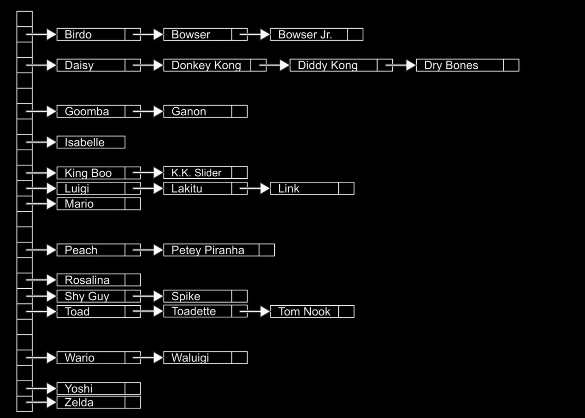

### C语言不同数据类型占据内存大小

| 数据类型 | 占据内存大小 |  sizeof() |
|----------|--------------|-----------|
| char     | 1 字节       |     1     |
| int      | 4 字节       |     4     |
| float    | 4 字节       |     4     |
| double   | 8 字节       |     8     |
| long     | 8 字节       |     8     |

### 数据结构

1. queue 队列，FIFO，先入先出，

```c
const int CAPACITY = 50;
//假设这个队列最多容纳50人
typedef struct {
    int people[CAPACITY];
    int size; //当前队列中人数
} queue;
```

有入队和出队两种操作，入队就是把一个人加入到队列的末尾，出队就是把一个人从队列的开头移除。

实际上我们希望内存可以动态分配，队列可以容纳任意人数，用数组就没法实现了，所以我们需要链表来实现队列.

2. stack 栈，LIFO，后入先出，

> 比如我们打开 Gmail，出现在顶上的邮件是我们最近收到的邮件，最先收到的邮件在最下面。我们可以把这个邮件列表想象成一个栈，最上面的邮件就是栈顶，最下面的邮件就是栈底。

```c
const int CAPACITY = 50;
typedef struct {
    int people[CAPACITY];
    int size; //当前栈中人数
} stack;
```

有入栈push和出栈pop两种操作，入栈就是把一个人加入到栈的顶端，出栈就是把一个人从栈的顶端移除。

3. 字典
> 字典是一种数据结构，它存储的是键值对（key-value pair），每个键都是唯一的，而值可以是任意类型的数据。字典允许我们通过键快速查找对应的值。

常规的是：电话薄，一个人的名字是键，电话号码是值。我们可以通过名字快速查找电话号码。
还有单词和他的解释，单词是键，解释是值。我们可以通过单词快速查找解释。

4. 数组（Array）
> 数组是一种数据结构，它存储的是一组相同类型的数据。数组允许我们通过索引快速访问每个元素。数组的大小是固定的，一旦创建就不能改变。

```c
#include <stdio.h>

int main(void){
    int list[5] = {1, 2, 3, 4, 5}; // 创建一个包含5个整数的数组
    for(int i = 0; i < 5; i++){
        printf("%d ", list[i]); // 输出数组中的每个元素
    }
    return 0;
}
```

使用数组在现实里面会存在的问题，因为大小是固定的，系统只保证分配那一块内存的空间，假设我们创建了一个数组，大小是5，那么我们只能存储5个元素，如果我们想要存储更多的元素，就会出现问题。

```c
#include <stdio.h>
#include <stdlib.h>
#include <ctype.h>

int main(int agrc, char *agrv[]){
    int *list = malloc(3 * sizeof(int)); // 创建一个包含5个整数的动态数组
    if(list == NULL) {
        return 1; // 检查内存分配是否成功
    }
    *list = 1;
    *(list + 1) = 2;
    *(list + 2) = 3;
    //如果这个时候需要存储更多的元素，就会出现问题，因为我们只分配了3个整数的空间。

    int *tmp = malloc(5 * sizeof(int)); // 创建一个新的动态数组，大小为5
    if(tmp == NULL) {
        free(list); // 释放之前分配的内存，因为只要内存分配失败，程序直接退出，但是之前的堆内存永远不会被释放，所以我们需要在退出之前释放之前分配的内存。
        return 1; // 检查内存分配是否成功
    }
    for(int i = 0; i < 3; i++){
        tmp[i] = list[i]; // 将原数组的元素复制到新数组中
    }
    free(list); // 释放原数组的内存
    list = tmp; // 将list指向新数组
    for(int i = 0; i < 5; i++){
        printf("%d ", list[i]);
    }
    free(list); // 释放动态分配的内存
    return 0;
}
```

```c
//其实有一种重分配内存的方式，叫做realloc()，它可以在不丢失原有数据的情况下，重新分配内存空间。
#include <stdio.h>
#include <stdlib.h>

int main(){
    int *list = malloc(3 * sizeof(int)); // 创建一个包含3个整数的动态数组
    if(list == NULL) {
        return 1; // 检查内存分配是否成功
    }
    list[0] = 1;
    list[1] = 2;
    list[2] = 3;

    int *tmp = realloc(list, 5 * sizeof(int)); // 重新分配内存空间，大小为5，并把原数组的元素复制到新数组中
    if(tmp == NULL) {
        return 1; // 检查内存分配是否成功
    }
    tmp[3] = 4;
    tmp[4] = 5;

    list = tmp; // 将list指向新数组
    
    for(int i = 0; i < 5; i++){
        printf("%d ", list[i]);
    }
    free(list); // 释放动态分配的内存
    free(tmp); // 释放动态分配的内存
    return 0;
}
```

所以我们需要链表来实现动态大小的数组。
## 链表（Linked List）

链表的每个节点的地址不需要像数组那样是连续的，链表的每个节点都包含一个数据域和一个指针域，指针域指向下一个节点的地址。链表的最后一个节点的指针域指向NULL，表示链表的结束。

**基础知识：**

指针是专门存放内存地址编号的特殊变量；64 位机器每个指针占 8 字节。
语法：`类型 *变量名`
`int* p`：p 存 int 变量地址，*p一次读 4 字节
不能直接给指针赋值数字常量（int* p=5非法），只能用&取变量地址或 malloc 堆地址；
核心操作：
- &变量：取变量的内存地址（右操作数）
- *指针：解引用，根据地址拿到对应数据（指针前加 *)

结构体的语法，是一种自定义的复合数据，把多种类型的变量打包。

```c
struct Student{
    char name[20];
    int age;
    float score;
};
```

`typedef` 给已有数据类型起别名，编译器处理时候会替换为原类型。
```c
typedef usigned int uint; //

typedef struct Student{
    char name[20];
    int age;
    float score;
}Stu;

int main(){
    Stu s1;//就不用写 Struct Stuent了。等效于 Struct Student s1;
    Stu *p;//定义一个指针变量，存储的是一个结构体变量的内存地址
    return 0;
}
```

然后再来看这个链表定义：

```c
#include <stdio.h>
//因为 C 编译的时候是按照从上到下的顺序编译的，所以我们需要在定义结构体的时候，先声明结构体的名字node，然后再定义结构体的内容。
typedef struct node{
    int data;
    struct node *next; //别名还没法用，这里必须这样写。创建了一个指针变量，指向的是一个结构体变量的地址。
}node;

int main(void){
    node *list = NULL; // 创建一个
    int num;
    for(int i = 0; i < 3; i ++){
        node *n = malloc(sizeof(node)); //指针变量用&变量或者 malloc 来分配地址。
        if(n == NULL){
            return 1; //分配内存失败
        }
        scanf("%d",&num);
        // (*n).data = num;
        // (*n).next = NULL;
        //万幸的是，C可以这样写
        n->data = num; //->包含了两个操作，第一，对指针进行解运算，访问指针地址，*；第二是.操作
        n->next = NULL;
        // 把新节点插入到链表的开头，前插法。
        n->next = list;
        list = n;
        //千万不能在这里就 free(n); //释放内存，释放了就没法访问了，脑子要清楚的想着地址
    }
    //然后我们来遍历链表，打印出链表中的数据
    node *ptr = list;//为什么 ptr？是 pointer的缩写
    while(ptr != NULL){
        printf("%d ", ptr->data);
        ptr = ptr->next;
    }
    return 0;
}
```

```c
//链表的尾插法
#include <stdio.h>
#include <stdlib.h>

typedef struct Node{
    int number;
    struct Node *next;
} Node;

int main(void){
    Node *list = NULL;
    int num;
    for (int i = 0; i < 3; i++){
        Node *n = malloc(sizeof(Node));
        if (n == NULL)
            return 1;
        scanf("%d", &num);
        n->number = num;
        n->next = NULL;
        if (list == NULL){
            // 链表空;
            list = n;
        }else{
            for (Node *ptr = list; ptr != NULL; ptr = ptr->next){
                if (ptr->next == NULL){
                    ptr->next = n;
                    break;
                }
            }
        }
    }
    for (Node *ptr = list; ptr != NULL; ptr = ptr->next){
        printf("%d\n",ptr->number);
    }

    for(Node *ptr = list; ptr != NULL;){
        Node *tmp = ptr;
        ptr = ptr->next;
        free(tmp);
    }
    return 0;
}
```

```c
//链表的尾插法，因为尾插法直接遍历输出就是正序输出，如何边插入边排序呢？
#include <stdio.h>
#include <stdlib.h>

typedef struct Node{
    int number;
    struct Node *next;
} Node;

int main(void){
    Node *list = NULL;
    int num;
    for (int i = 0; i < 3; i++){
        Node *n = malloc(sizeof(Node));
        if (n == NULL)
            return 1;
        scanf("%d", &num);
        n->number = num;
        n->next = NULL;
        if (list == NULL){
            // 链表空;
            list = n;
        }else{
            Node *prev = NULL;
            Node *ptr = list;
            while(ptr != NULL && ptr->number < n->number){
                prev = ptr;
                ptr = ptr->next;
            }
            if(prev == NULL){
                //插入到链表的开头
                n->next = list;
                list = n;
            }else{
                //插入到链表的中间或者末尾
                prev->next = n;
                n->next = ptr;
            }
        }
    }
    for (Node *ptr = list; ptr != NULL; ptr = ptr->next){
        printf("%d\n",ptr->number);
    }
    return 0;
}
```

数组有速度优势，链表有动态特性，如何把他们的优势结合起来呢？
### Tree 树

binary tree 二叉树，二叉树的每个节点最多有两个子节点，分别称为左子节点和右子节点。二叉树的根节点是树的最顶层节点，叶子节点是没有子节点的节点。

二叉搜索树（Binary Search Tree，BST）是一种特殊的二叉树，它满足以下性质：对于每个节点，其左子树中的所有节点的值都小于该节点的值，而其右子树中的所有节点的值都大于该节点的值。
BST具有递归性。

```c
typedef struct node{
    int data;
    struct node *left;
    struct node *right;
}node;

//就可以写一个递归函数来查找一个值是否存在于二叉搜索树中。

bool search(node *root, int value){
    if(root == NULL){
        return false; //如果根节点为空，说明树为空，返回false
    }
    if(root->data == value){
        return true; //如果根节点的值等于要查找的值，返回true
    }
    if(value < root->data){
        return search(root->left, value); //如果要查找的值小于根节点的值，递归查找左子树
    }else{
        return search(root->right, value); //如果要查找的值大于根节点的值，递归查找右子树
    }
}
```

注意，构建树的时候一定要精心设计顺序，否则很容易从树结构退化为链表结构，导致查找效率降低。为了避免这种情况，可以在插入节点时进行平衡操作，或者使用自平衡二叉搜索树（如AVL树或红黑树）来保持树的平衡性，从而提高查找效率。

## 哈希表（Hash Table）

哈希是一种将任意大小的数据映射到固定大小的数据的技术。
说人话就是把无限的定义域映射到有限定义域。

比如：电话簿，一个人的名字是键，电话号码是值。我们可以通过名字快速查找电话号码。这是怎么实现的呢？我们可以使用哈希函数将名字映射到一个固定大小的数组中的索引，然后在该索引处存储电话号码。这样，我们就可以通过名字快速查找电话号码，而不需要遍历整个电话簿。

```c
#include <ctype.h>
//哈希函数的实现
int hash(const char *name){ //为什么是 const char *name？因为我们不需要修改 name 的内容，只需要读取它的值，所以使用 const char * 可以提高代码的可读性和安全性，防止意外修改 name 的内容。
    // 这里是一个简单的哈希函数示例，实际应用中可能需要更复杂的哈希函数
    return toupper(name[0]) - 'A'; //假设我们只处理大写字母，返回名字的第一个字母对应的索引
}
```

哈希表是一种数据结构，它使用哈希函数将键映射到数组中的索引，从而实现快速的数据查找和插入。

哈希表是一个数组，每个元素都指向一个链表。
```c
typedef struct list{
    char *name;
    char *number;
    struct list *next;
}list;

int main(void){
    list *hash_table[26] = {NULL}; // 创建一个包含26个链表的哈希表，初始化为NULL
    // 这里可以插入数据到哈希表中
    return 0;
}
```
<div align="center">
  
</div>

### 字典树 Trie

字典树，Trie（其实是 retrival，检索的缩写）又称前缀树，是一种用于高效存储和检索字符串的数据结构。它的主要特点是通过共享公共前缀来节省空间，并且可以快速地进行字符串的插入、查找和删除操作。

