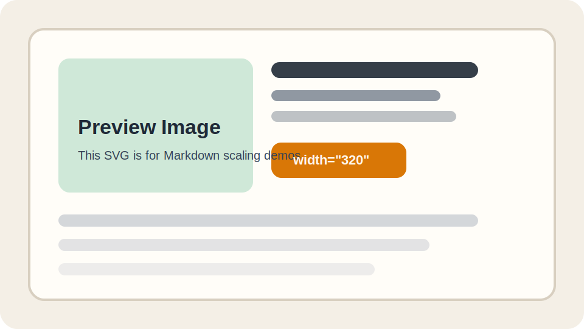

## 结论先说

如果你想在 **VS Code 里边写 Markdown，边实时预览**，同时又想让图片能缩放：

**最稳妥的写法是直接用 HTML 的 `` 标签。**

标准 Markdown 的这类写法：

```md

```

只能显示图片，**不能直接控制宽度**。

---

## 推荐语法

### 1. 固定宽度

```html

```

效果示例：


### 2. 百分比宽度

```html

```

效果示例：


### 3. 居中 + 缩放

```html
<div align="center">
  
</div>
```

效果示例：

<div align="center">
  
</div>

---

## 在这个博客项目里怎么放图片

这篇示例笔记的目录结构是：

```text
content/posts/Examples/
├── markdown-image-scaling-demo.md
└── images/
    └── scale-demo.svg
```

也就是说：

1. 笔记文件和 `images/` 文件夹放在同一目录
2. Markdown 里继续写相对路径，比如 `images/scale-demo.svg`
3. 如果只是想要 VS Code 预览里也能缩放，就优先用 ``

---

## 和 NoteImage 的区别

如果你写：

```jsx
<NoteImage src="images/scale-demo.svg" alt="示例图片" width="320" />
```

它更适合**网站最终展示**，但 **VS Code 的普通 Markdown 预览不会执行这个组件**。

所以你的使用建议可以简单记成：

- 要 **VS Code 实时预览**：用 ``
- 要 **网站里统一排版能力**：用 `<NoteImage>`

---

## 以后直接照抄的模板

```html

```

或者：

```html

```
